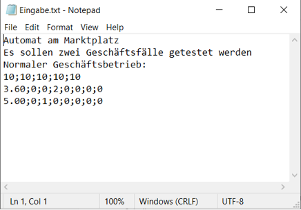

# Der robuste Fahrkartenautomat
## Übersicht
  
Im Rahmen der Integration Semester in Meknes ist dieses Projekt erledigt. Das Ziel des Projekts ist es, ein Programm zu entwickeln, das die Simulation mit Randbedingungen durchführt. Die Randbedingungen dieses Programms sind festgesetzt. 
## Aufgaben 
-	🎯 Es wird Modell entwickelt, das einen Fahrkartenautomaten mit den angegebenen Randbedingungen simulier  
-	🎯 Es wird ein Algorithmus entworfen, das wenig Geldstücken ausgibt  
-	🎯 Es wird objektorientierte Programmierung (OOP) nutzen, um Erweiterbarkeit zu gewährleisten  
-	🎯 Es wird ausführbarer Form des Quellcodes erstellt  

## Eingabe 
Es wird hier über zwei Formen gesprochen: 
•	Form 1: besteht aus fünf Zahlen, und folgt die folgende Reihenfolge: 2€, 1€, 50 Cent, 20 Cent, 10 Cent. 
•	Form 2: besteht aus sieben Zahlen, und folgt die folgende Reihenfolge: 10€, 5€, 2€, 1€, 50 Cent, 20 Cent, 10 Cent.
•	Form 3: besteht aus acht Zahlen, und folgt die folgende Reihenfolge: Fahrpreis, 10€, 5€, 2€, 1€, 50 Cent, 20 Cent, 10 Cent. 
Alle Formen sind getrennt mit „;“(Semikolon), und Jeder Zahl stellt die Zahl der Münzen oder Scheinen dar.

Eingabedaten sind aus einer Eingabedatei extrahiert. Die drei ersten Zeilen der Eingabedatei sind Kommentaren, die die Geschäftsfälle schildern. Die vierte Zeile enthält den Münzbestand (in Form 1) des Automaten zum Programmstart. Nach dem Münzbestand stehen die Geschäftsfälle, die vom Programm simuliert werden. Jeder Geschäftsfall (in Form 2) ist in einer Zeile geschrieben. Die erste Zahl ist der Fahrpreis, und die übrigen Zahlen sind die eingeworfenen Scheine und Münzen. 

## Ausgabe

Auf der Anwendungsschnistelle wird die Ausgabe gezeigt. Die drei ersten Zeilen der Ausgabe sind gleich wie die Eingabedatei (Kommentaren). Der Inhalt der dritten Zeile ist der Anfangsbestand, er ist sowohl in Euro als auch in Form 3.Danach stehen die Ergebnisse jeden Geschäftsfalls. Da gibt es der Buchungspreis (in Euro), die Rückgabe (in Form 1) und der Gesamtbestand (in Euro und Form 2).

# Ausführung Beispiel (normaler Fall)
## Eingabe Datei  

:star2: In diesem Beispiel handelt es sich um zwei Geschäftsfälle zu simulieren. Die Eingabedatei hat folgenden Inhalt:

Der Automat erhält also zu Anfang jeweils zehn Stücke von den möglichen Münzen, das heißt, dass der Münzbestand zehn Stücke von: 2€, 1€, 50 Cent, 20 Cent, und 10 Cent enthält. Zwei Geschäftsfälle werden simuliert. Der erste Geschäftsfall hat als Fahrpreis 3.60€, und zwei Stücke von 2.00€ sind eingeworfen. Der zweite Geschäftsfall hat als Fahrpreis 5.00€, und ein Stück von 5.00€ sind eingeworfen.  
Der Anfangsbestand beträgt 38.0€.  

:star2: Buchung 1:  
Das Wechselgeld ist: 4.00€ - 3.60€ = 0.40€ = 2 * 20 Cent.
Die ideale Rückgabe ist: zwei Stücke von 20 Cent (im Form 1: 0;0;0;2;0).
Gesamtbestand ist: 38.00€ + 3.60€ = 41.60€ (im Form 2: 0;0;12;10;10;8;10).  
:star2: Buchung 2:    
Das Wechselgeld ist: 5.00€ - 5.00€ = 0€.
Die Rückgabe hier ist null (im Form 1: 0;0;0;0;0).
Gesamtbestand ist: 41.60€ + 5.00€ = 46.60€ (im Form 2: 0;1;12;10;10;8;10).  

## Ausgabe

